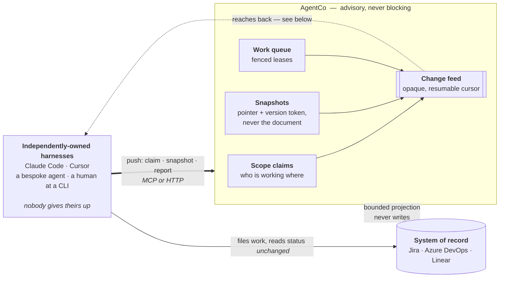
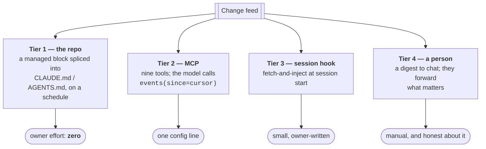

# AgentCo

**A coordination layer for organisations running more than one agentic harness.**

Everyone on your team is running their own AI coding agent. Different tools, different
vendors, no two configured the same — and nobody is giving theirs up. Individually they
work fine. Together they are blind to each other:

- Two agents edit the same directory and nobody finds out until the merge.
- One builds against a spec that changed last Tuesday.
- An agent hits something it cannot decide, asks a human, and the question goes nowhere —
  because nothing guaranteed it was delivered.

AgentCo holds the three things nothing else holds: **the claims people and agents make
about each other's work**, **the pointers you built against, so you are told when they
move**, and **a router that puts a decision in front of a named human and records the
acknowledgement**.

The organizing idea is the **ASOP — Agentic Standard Operating Procedure**
([full definition](docs/asop.md)): a procedure that is **versioned** (outcomes
recorded per version, never per vibe), **verified** (it carries its own definition
of done — a deterministic check, a fixed rubric, or a named human's sign-off,
enforced where completion is recorded so no executor grades its own homework), and
**self-revising** (plan-vs-actual divergence feeds the next version instead of a
postmortem nobody reads). *An SOP tells an agent what to do; an ASOP can prove it
was done and gets better when it wasn't.* AgentCo is the plane that stores ASOPs,
versions them, records their outcomes, and routes their human gates — whatever
work-unit your harness uses to execute them (ours is called a bead).

It sits **above** agent memory and context stores — an agent's own recall is its
harness's business (that layer is well served by projects like
[OpenViking](https://github.com/volcengine/OpenViking)); AgentCo coordinates what
happens **between** agents and the people who own them. Likewise it is not a personal-AI
framework: projects like [LifeOS](https://github.com/danielmiessler/LifeOS) run *one*
principal's assistant superbly — AgentCo is the layer they plug into the moment an
organisation runs more than one.

## How it works



Everyone keeps their own harness. The system of record stays authoritative — AgentCo
holds only the things nothing else does, and if it disappears every tool falls back to
exactly what it does today.

### Getting information back to a harness

Nothing can *push* into a model's context; a harness assembles that itself, at turn
boundaries. So reaching one is always one of three moves — write into a file it already
reads, give the model a reason to ask, or tell the human.



**Tier 1 is the only one that reaches a harness nobody configured**, which is the premise
of the project. It is also the one that has to be careful, because it edits a file in
somebody else's repository: the splice reads and writes bytes, matches the file's own line
endings, never touches a byte outside its markers, never creates a file that does not
exist, and is dry-run by default.

Tiers 1 and 3 also carry *the instruction to pull* — which is what stops tier 2 being a
tool the model has to remember on its own.

## What it is not

**It is not your system of record.** Jira, Azure DevOps, Linear and GitHub Issues stay
authoritative. AgentCo never becomes the place work lives, and it holds no competing
version of a fact another system owns.

**It never blocks anyone.** Scope claims are advisory. If AgentCo is down, every tool
falls back to exactly what it does today.

**It does not replace your harness.** Claude Code, Cursor, Copilot, Aider, a bespoke
in-house agent — keep all of them. Integration is one config entry, and nothing about
how your harness works changes.

## Status

**Early, and usable.** The coordination primitives are implemented and tested: scope
claims with conflict detection, snapshot pointers with divergence delivered at a cadence
boundary, a resumable change feed, a work queue with a fenced lease protocol proven across
twelve real processes, versioned SOPs, an MCP surface, and both injection tiers. See
[`docs/`](docs/) for the design, [`docs/roadmap.md`](docs/roadmap.md) for what is built
versus planned, and [`docs/known-issues.md`](docs/known-issues.md) for what is broken.

The project's own adoption gate is written down and deliberately hard to game: **two
identities other than the author publishing weekly for four consecutive weeks.** Stars
are the vanity metric that will be available; weekly publishers are not. A public repo
with no users is a worse outcome than a private tool with two, because it looks like
adoption while being none.

## Design principles

These are load-bearing, and each was derived from a failure mode rather than from taste.

| Principle | Why |
|---|---|
| **Any tool may push. No tool may file.** | A push is a signal; the owning controller decides what becomes work — with a clock, because "I pushed and nothing happened" is the most adoption-lethal outcome available. |
| **Advisory, never blocking.** | Making concurrency visible is most of the value and none of the political cost — but only if it never stops anyone working. |
| **Pointers, never copies.** | Snapshots record a URI plus a cheap version token. No document body is ever stored. A second document store is how a coordination layer becomes a system of record by accident. |
| **Fail static.** | If the plane is down, nothing is blocked; it reconciles when it returns. |
| **Every refusal carries a remediation.** | A tool that refuses without saying what to do instead teaches people it is broken. *(Four error paths still return a bare 500 instead of a refusal — known, with failing tests against them.)* |
| **Anything naming a company is configuration, not code.** | Which is what makes this repo publishable at all — see [CONTRIBUTING](CONTRIBUTING.md). |

## Getting started

Requires Python 3.11+ and [uv](https://docs.astral.sh/uv/).

```bash
git clone https://github.com/mabidoli/agentco && cd agentco
uv run --extra dev --extra server --extra mcp pytest -q
```

### Run it

Point it at a directory for its state, mint a secret for yourself, and start the
service:

```bash
export AGENTCO_REGISTRY_DB=~/.agentco/registry.sqlite3
export AGENTCO_WORK_STORE=~/.agentco/work.jsonl
export AGENTCO_REGISTRY_KEYS=~/.agentco/keys.json

python3 -m agentco keygen you > ~/.agentco/keys.json   # then chmod 600
python3 -m agentco serve --port 8787                   # loopback by default
```

Or in Docker — one container, state on a named volume, port published to
loopback only:

```bash
python3 -m agentco keygen you > keys.json && chmod 600 keys.json
docker compose up -d --build registry
```

See [`docs/docker.md`](docs/docker.md) for what the image mounts and why, the
cadence job, and why the MCP surface is deliberately not containerised.

### Publish something

`agentco/publish.py` is standard-library only and meant to be copied next to
whatever you already run. No install required on the calling side.

```python
from agentco.publish import Registry

reg = Registry("you", SECRET, "http://127.0.0.1:8787")

# "I am about to work in these directories." Advisory — it blocks nobody.
lease = reg.claim_scope("acme/web-platform", ["src/billing/invoices"], "implement")
for c in lease["conflicts"]:
    print(f"{c['withHolder']} is already in there, intent={c['theirIntent']}")

# "I am working from this version of that." The document is never fetched or stored.
reg.snapshot("git:/path/to/repo#main", "baseline for the redesign")

# Catch up on everything since your last cursor.
feed = reg.events()
```

### Connect a harness

One entry in your `.mcp.json`, and nothing about how your harness works changes:

```json
{
  "mcpServers": {
    "agentco": {
      "command": "python3",
      "args": ["-m", "agentco", "serve-mcp"],
      "env": {
        "AGENTCO_ACTOR": "you",
        "AGENTCO_REGISTRY_DB": "/path/to/registry.sqlite3",
        "AGENTCO_WORK_STORE": "/path/to/work.jsonl",
        "AGENTCO_SOP_STORE": "/path/to/sops.jsonl"
      }
    }
  }
}
```

Nine tools, and nine is a ceiling enforced by a test rather than remembered — a
large tool surface costs every calling harness context on every tool-choice
decision it makes.

That entry points the harness at **local files**, which is right when the
harness and the registry share a disk. When they do not — a second machine, a
container, a colleague's laptop — the same primitives are on the HTTP surface,
and `publish.py` speaks it:

```python
reg = Registry("macbook", SECRET, "http://registry.example.com:8787")

pulled = reg.work_pull()                      # fenced lease, or state="empty"
if pulled["state"] == "leased":
    item = pulled["item"]
    reg.work_report(item["id"], pulled["attempt"], "done", result="…")

# A lesson learned on one machine, active for every reader on the next call.
reg.sop_revise(sop_id, common_mistakes=["Report with the attempt from work_pull"])
reg.sop_activate(sop_id, 2)
```

The claiming identity is the **authenticated actor**, never a field in the
body — a worker that can name itself can take another worker's lease, and the
fence would faithfully record the theft as legitimate. Send `attempt` back with
every report: a report that arrives after the lease moved is refused as
*superseded* rather than overwriting whoever holds the item now.

### Reach a harness nobody configured

The above is pull-only: the model asks, AgentCo answers. To reach an agent whose
owner has done nothing at all, write into a file it already reads.

```bash
# Splice live scope claims into the repo's agent-context file. Dry run first.
python3 -m agentco inject CLAUDE.md AGENTS.md --repo acme/web-platform
python3 -m agentco inject CLAUDE.md AGENTS.md --repo acme/web-platform --write

# Or, per person rather than per repo: a session-start hook.
python3 -m agentco hook install ~/.claude/settings.json --write
```

`inject` writes a marker-delimited block and touches nothing outside it,
preserving the file's own line endings. `hook` takes a verbatim backup so
`uninstall` restores the original bytes exactly.

### Read the honest numbers

```bash
python3 -m agentco metrics        # weekly publishers, latency, conflict precision
python3 -m agentco gate1          # exit 0 iff the adoption gate is met
```

### Before you rely on it

Read [`docs/known-issues.md`](docs/known-issues.md). Twenty defects are open and
documented, each with a failing test naming the property that should hold. None
of them lose work or report a wrong result as a right one — those were found and
fixed. Being told what is broken is the point; a project this young that claims
none would be lying.

## Licence

[Apache License 2.0](LICENSE). Apache rather than MIT for the explicit patent grant,
which matters when the thing being adopted is infrastructure inside a company.
