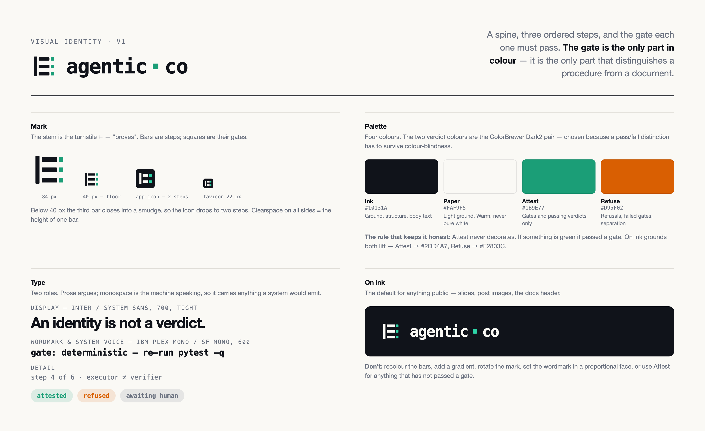

# Agentic Co — visual identity, v1

One idea carries the whole system: **a procedure is a sequence of steps, and each
step has a gate it must pass**. The mark draws exactly that, the palette colours
only the gate, and the typography splits prose from what a machine emits. If a
future asset does not express that idea, it is off-brand regardless of how it
looks.

## The mark

A vertical stem with three bars running off it, each bar ending in a detached
square.

- The stem is the turnstile `⊢` — the assertion sign, "proves". Everything is
  asserted from somewhere.
- The bars are ordered steps.
- The squares are their gates: detached, because a gate is separate from the work
  and is passed *after* it.

| file | use |
|---|---|
| `logo/mark.svg` · `mark.png` | on light grounds |
| `logo/mark-inverse.svg` · `mark-inverse.png` | on ink |
| `logo/lockup.svg` · `lockup.png` | mark + wordmark, horizontal |
| `logo/lockup-inverse.svg` · `lockup-inverse.png` | the same, on ink |
| `logo/favicon.svg` · `icon-512/180/32.png` | app icon and favicon |

**Clearspace** on every side is the height of one bar. **Minimum size** for the
three-bar mark is 40 px — below that the bars close into a smudge, which is why
the icon variant drops to two steps and gains a rounded container.

**Don't**: recolour the bars, add a gradient, rotate it, outline it, put the
wordmark in a proportional face, or stretch the lockup.

## Palette

| token | light | on ink | used for |
|---|---|---|---|
| **Ink** | `#10131A` | — | ground, structure, body text |
| **Paper** | `#FAF9F5` | — | light ground — warm, never pure white |
| **Attest** | `#1B9E77` | `#2DD4A7` | gates, passing verdicts |
| **Refuse** | `#D95F02` | `#F2803C` | refusals, failed gates, separation (`≠`) |
| **Muted** | `#6B7280` | `#7C889B` | labels, secondary prose |

Attest and Refuse are the ColorBrewer **Dark2** pair, picked deliberately: a
pass/fail distinction that a colour-blind reader cannot make is not a
distinction. Contrast on both grounds clears WCAG AA for the sizes used.

**The rule that keeps the palette honest: Attest never decorates.** If something
is green, it passed a gate. The moment green becomes a generic accent, the mark
stops meaning anything and the identity is just three bars.

## Typography

Two voices, and the split is the point — prose argues, monospace is the system
speaking.

- **Display / prose** — Inter, falling back to the platform sans. 700, tracking
  −2 to −3 at display sizes.
- **System voice** — IBM Plex Mono, falling back to SF Mono / Menlo. 600 for the
  wordmark, 400–500 for field values. Everything a system would emit lives here:
  step names, gate kinds, verdicts, commands, identifiers.

The wordmark is `agentic` + a gate square + `co`, all lowercase, mono, tracking
−1. The separator is lifted straight from the mark.

> Neither face is installed on every machine. The SVGs reference them by name
> with system fallbacks, so **the PNG exports are the canonical renders** —
> re-export rather than assuming a viewer has the font.

## Voice

Plain, specific, and willing to say what does not work yet. The project's whole
argument is that claims need evidence, so marketing language that outruns the
implementation damages it more than it helps. Name the gap — "attestations
aren't signed yet" — in the same breath as the claim.

Lowercase for the wordmark, sentence case everywhere else. No exclamation marks.

## Regenerating

The PNGs come from the SVGs and two HTML sheets via headless Chrome; the render
helper and sources live in the session scratchpad rather than here, because they
are a build step and not an asset. To re-export, render each SVG at 4× and the
sheet at 1600×980 @2×.
